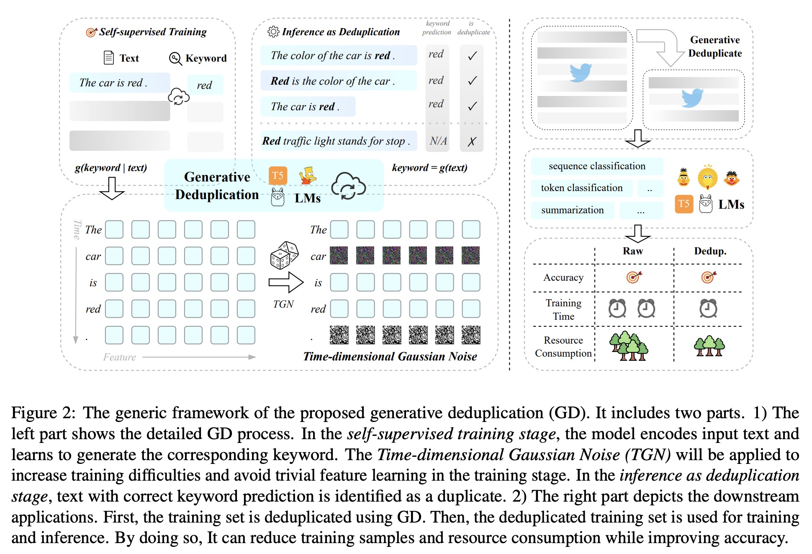

# Generative Deduplication (Findings of EMNLP 2024)

Revisiting data deuplication, we propose a fresh paradigm for semantic deduplication.

- Arxiv: https://arxiv.org/abs/2401.05883




**Core Idea:**

- Generative language models possess powerful language understanding capabilities. We use it for semantic deduplication.
- There are two crucial stages in generative deduplication:
  - **Memory stage**: The model learns the relationship between context and corresponding keywords. Semantically duplicate contexts establish stronger connections than non-duplicate ones in one-epoch training.
  $$g(y|context)$$
  - **Inference stage**: During inference, we use the trained generative model to generate keywords from the given context. If the generated keywords match the target keywords, we classify the data as duplicate.
  $$g(context) == y?$$


## Installation

```bash
python -m pip install gen-dedup
```

## Usage

```python
from datasets import load_dataset
from keybert import KeyBERT
from gen_dedup import GenDedup

# 1. Load dataset
ds = load_dataset('cardiffnlp/tweet_eval', 'hate', split='train')
ds = ds.select_columns(['text'])
ds = ds.rename_column('text', 'sentence')

# 2. Generate keywords with KeyBERT. Other keyword extraction models can also be used.
keybert = KeyBERT()
# Here, we generate two keywords.
max_label_words = 2
ds = ds.map(lambda x: {
    'labels': " ".join([k[0] for k in keybert.extract_keywords(x['sentence'].lower())[:max_label_words]]),
    'sentence': x['sentence'].lower()})

# 3. Fit the generative model to learn g(y|X)
gd = GenDedup('google/flan-t5-small')
gd.fit(ds, output_dir='./hate-dedup')

# 4. Inference as Deduplication. Check whether g(X) = y
gd.deduplicate('./hate-dedup', max_label_words=max_label_words)
```

The trained model, duplicate data, and non-duplicate data will be saved in the `./hate-dedup` directory.


## Citation

```bibtex
@article{li2024generative,
  title={Generative Deduplication For Socia Media Data Selection},
  author={Li, Xianming and Li, Jing},
  journal={arXiv preprint arXiv:2401.05883},
  year={2024}
}
```
